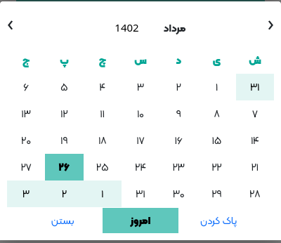

# mpdatepicker

Materialize Persian Date and time picker by A1Gard 4xmen.ir

## installation

+ npm:
    + `npm i mpdatepicker`
+ yarn:
    + `yarn add mpdatepicker`

## screenshot

<div align="center">



</div>

## How to use

Add jquery:

```html

<script type="text/javascript" src="../dist/jquery.min.js"></script>
```

Add additional font for best view or use [Vazir-Matn-Font](https://www.npmjs.com/package/vazirmatn):

```html

<link type="text/css" rel="stylesheet" href="https://cdn.jsdelivr.net/gh/rastikerdar/vazirmatn@v33.003/Vazirmatn-font-face.css"/> 
```

Add css and jquery plugin To end of your project:

```html

<script type="text/javascript" src="node_modules/mpdatepicker/dist/jquery.mpdatepicker.min.js"></script>
<link type="text/css" rel="stylesheet" href="node_modules/mpdatepicker/dist/jquery.mpdatepicker.min.css"/>
```


Add Html :

```Html
<input class="sample-date-picker bg-white w-100 p-3"
       placeholder="تاریخ" type="text" id="date">
```     


use plugin :

```javascript
$(function () {
    $(".sample-date-picker").mpdatepicker({
        'timePicker': true,
        onOpen: function () {
            console.log('open');
        },
        onSelect: function (selected) {
            console.log('select', selected);
        },
        onChange: function (oldVal, newVal) {
            console.log('change', oldVal, newVal);
        },
        onClose: function () {
            console.log('close');
        },
    });
});
```

## Options & events

| name  | default  |  action  |
| ------------ | ------------ | ------------ |
| timePicker  |  `false`  |  time picker active or not  |
|  timeChangeSensitivity |  `5`  |  time picker sensitivity on drag up/down  |
| fontStyle  | `null`  | font style for modal  |
| gSpliter  |  `-` |  split date |
|  onOpen | event  | trigger when open modal  |
|  onClose | event  | trigger when close modal  |
|  onSelect | event  | trigger on select end   |
|  onChange  | event  |  trigger on change selected |
